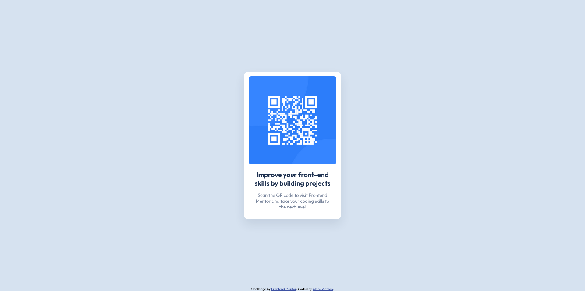

# Frontend Mentor - QR code component solution

This is a solution to the [QR code component challenge on Frontend Mentor](https://www.frontendmentor.io/challenges/qr-code-component-iux_sIO_H). Frontend Mentor challenges help you improve your coding skills by building realistic projects. 

## Table of contents

- [Overview](#overview)
  - [Screenshot](#screenshot)
  - [Links](#links)
- [My process](#my-process)
  - [Built with](#built-with)
- [Author](#author)

## Overview

### Screenshot

### Links

- Solution URL: [https://github.com/cwatso/qr-code-component-main/](https://github.com/cwatso/qr-code-component-main/)
- Live Site URL: [https://cwatso.github.io/qr-code-component-main](https://cwatso.github.io/qr-code-component-main)

## My process

This was a simple project built with basic HTML and CSS. I used SASS for the CSS to practice.

### Built with

- Semantic HTML5 markup
- SASS
- Flexbox
- Mobile-first workflow

## Author

- Frontend Mentor - [@cwatso](https://www.frontendmentor.io/profile/cwatso)
